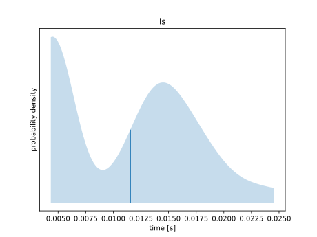
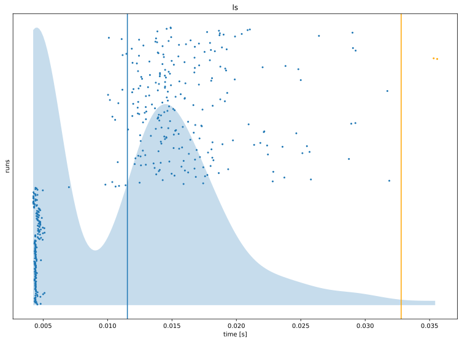
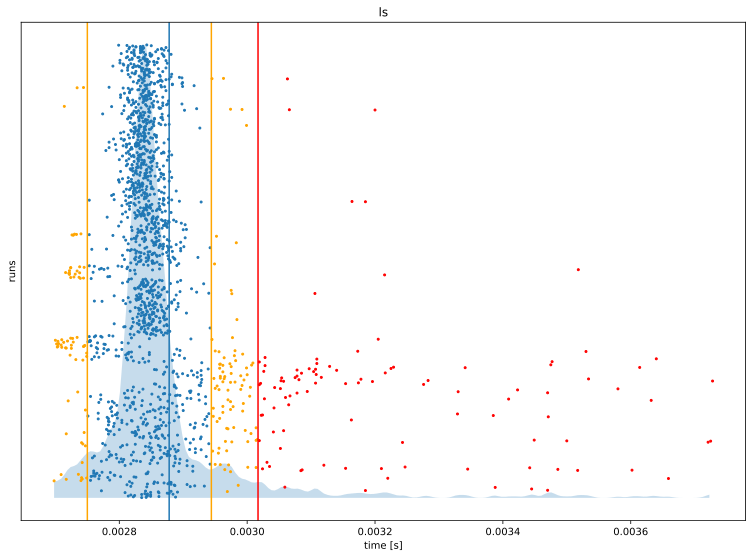

# User guide

This file is an informal description of `csbench`. 

## Introduction

To start using `csbench` it is important to remember that it is not a silver bullet and does not try to be extra versatile. 
The scope of usage is clearly defined for specific cases. 
Proficiency with this tool should come from understanding these use cases.

First of all, we can divide benchmarks in two groups by the purpose of their results:
* results are used by developer to find bottlenecks, compare different algorithms etc.
* results are used to present something to others, for example in form of a plot

Both groups are similar in the sense that doing them good requires a lot of effort. 

In the first case it is hard to write benchmark in a way reflecting that how the program is actually used. 
Selection of timing mechanism is of a most importance. 
Despite the fact that there are a lot of [materials](https://book.easyperf.net/perf_book) on how to do CPU benchmarks, it does not become easy.

In the second case it is hard to select the form of visualization accurately conveying the data ([link](https://clauswilke.com/dataviz/)).
And moreover, it is even harder to do that automatically.  
For example, bucket size of histogram should always chosen manually, otherwise image would be incomprehensible.

`csbench` tries to aid developers doing both kinds of benchmarks. How is this going to be achieved?
By being easy to use in most common cases and allowing easy modification for more complex ones. 

Benchmarks are typically used to compare different algorithms on same data and find out the way algorithms depend on different input parameters.

How this is typically done? By running algorithm multiple times and averaging the parameter benchmarked.
This approach has several downsides. Average (or mean), as a single statistic can't be used to properly reflect the data set. 
Computer benchmarks are typically noisy, and the amount of noise varies substantially: parameter distribution can become heavily skewed or even multi-modal.

Because of this visualization is very important. By looking at distribution plot anomalies can be easily spotted. 
`csbench` makes visualization of data on the most important priorities. 
However, it should not become a burden.

## How to run `csbench`

`csbench` has a CLI API and is heavily relying on shell in its operation.

Following examples describe some of the most common use cases. 
For further information look at the `--help` output. 

#### compare execution time of two commands
```sh
$ csbench ls lsd
```
#### compare execution time of two commands and generate plots
```sh
$ csbench ls lsd --plot
```
#### compare execution time of two commands and generate html report
```sh
$ csbench ls lsd --html
```
#### run parameterized benchmark 
```sh
$ csbench 'ls {what}' --param what/a/b
$ csbench 'sleep {t}' --param-range t/0.1/0.5/0.1
```
#### benchmark using custom parameter acquired from command output
```sh
$ cat test.py # not actual code
start = time()
n = fib(100) # do something
print(time() - start)
$ csbench 'python3 test.py' --custom py-time --no-wall
```
#### run parameterized benchmark and use custom parameter
```sh
$ cat test.py # not actual code
start = time()
n = fib(int(input())) # do something
print(time() - start)
$ csbench 'echo {n} | python3 test.py' --custom py-time --no-wall --param-range n/1/100/10
```

## How to understand and use `csbench` output

```
$ csbench ls --shell=none --html
measurement wall clock time
benchmark ls
3090 runs                                               # 1
 q{024} 1.449 ms 1.583 ms 2.920 ms                      # 2
   mean 1.607 ms 1.611 ms 1.615 ms                      # 3
 st dev 97.13 μs 107.5 μs 118.1 μs
systime 936.7 μs 939.0 μs 941.3 μs
usrtime 277.4 μs 278.2 μs 279.0 μs
336 outliers (10.87%) severe (98.1%) effect on st dev   # 4
  2 (0.06%) low mild
  170 (5.50%) high mild
  164 (5.31%) high severe
```
1. `csbench` automatically determines how many times to run benchmark. 
    By default it makes at least 10 runs and runs for at least of 5 seconds of wall clock time. 
    Default behavior can be changed with options `--time-limit`, `--runs`, `--min-runs`, `--max-runs`.
2. Minimum, median and maximum of observed values.
    Typically when benchmarking big programs these tend to range dramatically, so it is important to take a loot at them.
3. [Bootstrap](https://en.wikipedia.org/wiki/Bootstrapping_(statistics)) estimates of mean wall clock time, standard deviation of wall clock time and mean of CPU time.
    Number of bootstrap resamples can be changed with option `--nrs`.
    One can compare sum of CPU time and wall clock time to see how much time process has been sleeping, or estimate overhead.
    Values on the left and the right are bounds of observed during bootstrap values, value in the middle is the statistic on whole data set.
    Typically big difference in mean time indicates high skew of data.
4. Outliers here are chosen in somewhat arbitrary way, but do indicate how much of heavily outlying measurements there is. 
    Look below for additional information.

How outliers are decided:
|X < q1 - 3 iqr|X < q1 - 1.5 iqr|others|X > q3 + 1.5 iqr|X > q3 + 3 iqr|
|--------------|----------------|------|----------------|--------------|
|low severe    |low mild        |   ok |high mild       |high severe   |

Here q1 and q3 are first and third quartiles, and iqr is interquartile range.

```
$ csbench 'sleep {t}' --param-range t/0.1/0.5/0.1 --runs=10 --regr
...
fastest is sleep 0.1                                                # 1
slowest is sleep 0.5
  sleep 0.1 is 1.880 ± 0.030 times faster than sleep 0.2 (p=0.00)   # 2
  sleep 0.1 is 2.782 ± 0.042 times faster than sleep 0.3 (p=0.00)
  sleep 0.1 is 3.660 ± 0.067 times faster than sleep 0.4 (p=0.00)
  sleep 0.1 is 4.576 ± 0.068 times faster than sleep 0.5 (p=0.00)
linear (O(N)) complexity (1.00488)                                  # 3
```

1. Executing parameterized benchmark is partially equivalent to running same benchmark with explicitly generating all commands:
    ```
    $ csbench 'sleep 0.1' 'sleep 0.2' 'sleep 0.3' 'sleep 0.4' 'sleep 0.5' --runs 10
    ```
2. Time comparison as ration between means of wall clock time, and ± range using [propagation of uncertainty](https://en.wikipedia.org/wiki/Propagation_of_uncertainty).
3. Sometimes be executing parameterized benchmark user wants to find dependency between values.
    `csbench` applies linear regression to try to guess complexity in terms parameter. 
    It considers following complexities: O(1), O(N), O(N^2), O(N^3), O(logN), O(NlogN).
    Number given is a linear multiplier of complexity.
    It becomes most evident and useful when plotted.

Now let's look at some of the plots. 
First plot is [KDE](https://en.wikipedia.org/wiki/Kernel_density_estimation).
It tries to visualize the distribution by plotting its [PDF](https://en.wikipedia.org/wiki/Probability_density_function). 
KDE is chosen over histogram because its bandwidth can be chosen automatically more reliably than bucket size in histogram. 
Blue line on the plot is mean.


KDE is somewhat similar to PDF of normal distribution, although dispersion seems high. 
But this is normal for shell benchmarks, because shell noise is significant.
Also mean is close to the [mode](https://en.wikipedia.org/wiki/Mode_(statistics)), which is good.



Distribution is bimodal: there are two peaks. 
Let's look at the extended KDE plot, which also shows outliers, and how samples are scattered.



Vertical line describes benchmark it time. 
Dots are individual measurements.
It can be clearly seen that during benchmark run environment has heavily changed - time distribution of runs in the beginning is heavily different from the ones in the end.
This example was produced by starting compilation in the middle of benchmark to show how other processes on the system affect benchmark results visually.



This is OK benchmark results - although there are outliers, they don't seem to happen systematically. 
Also note patterns in low mild outliers, which occur in bulk. 

## Some other features

### Get python sources used to make plots

`--plot-src` option can be used to produce python files used to generate plots.
Data is hardcoded in these scripts, so that in case user wants to modify them (change colors, add legend, change language...) they can do that with minimal effort.

### Custom measurement units

There are three options for custom measurements: `--custom`, `--custom-t`, `--custom-x`.
They differ in units of measurement and how they extract values from stdout.
|feature|--custom|--custom-t|--custom-x|
|-------|--------|----------|----------|
|units  |seconds | seconds  | custom   |
|extract|cat     | custom   | custom   |

If units is one of `ns`, `us`, `ms`, `s`, measured values are pretty printed as time.
If units is one of `b`, `kb`, `mb`, `gb`, measured values are pretty printed as memory.
If units is `none`, no units are assumed.

### Debugging 

`--output` can be set to `inherit`. This way stdout and stderr of executed commands are printed in the terminal, which can be useful for debugging.

### Changing shell

By default commands executed using /bin/sh. User has the option to change that using option `--shell`.
Its argument is a command that expands in shell invocation. Command is executed by appending `-c` and command source to shell argv list. Alternatively, `none` can be used to execute commands using execvp directly. 

### Removing wall clock analysis 

If user specifies custom measurement, chances that they prefer these results over wall clock time analysis.
However, wall clock time information is still included. 
Option `--no-wall` can be set to explicitly remove wall clock analysis from CLI output, plots, and html report. 

### Parallel benchmarking

The default behavior of `csbench` is to benchmark all commands sequentially.
It is possible to run benchmarks in parallel. Number of threads can be specified using `--jobs` option. Note that in some cases it may be undesirable to execute commands in parallel, for example in cases they are performing a lot of IO.

### Accessing resource usage and PMU

`csbench` can be used to access `struct rusage` fields and certain PMU counters.
`--meas` option can be supplied with comma-separated list of measurement names, which 
tell csbench to use this value in analysis. Possible measurement names:
* `stime` - `ru_stime` of `struct rusage`, CPU system time
* `utime` - `ru_utime` of `struct rusage`, CPU user time
* `maxrss` - `ru_maxrss` of `struct rusage`, maximum RSS (resident set size) of process or its children
* `minflt` - `ru_minflt` of `struct rusage`, number of minor page faults
* `majflt` - `ru_majflt` of `struct rusage`, number of major page faults
* `nvcsw` - `ru_nvcsw` of `struct rusage`, number of voluntary context switches
* `nivcsw` - `ru_nivcsw` of `struct rusage`, number of non-voluntary context switches
* `cycles` - PMU cycles count
* `instructions` - PMU instructions count
* `branches` - PMU taken branch count
* `branch-misses` - PMU missed branch count

